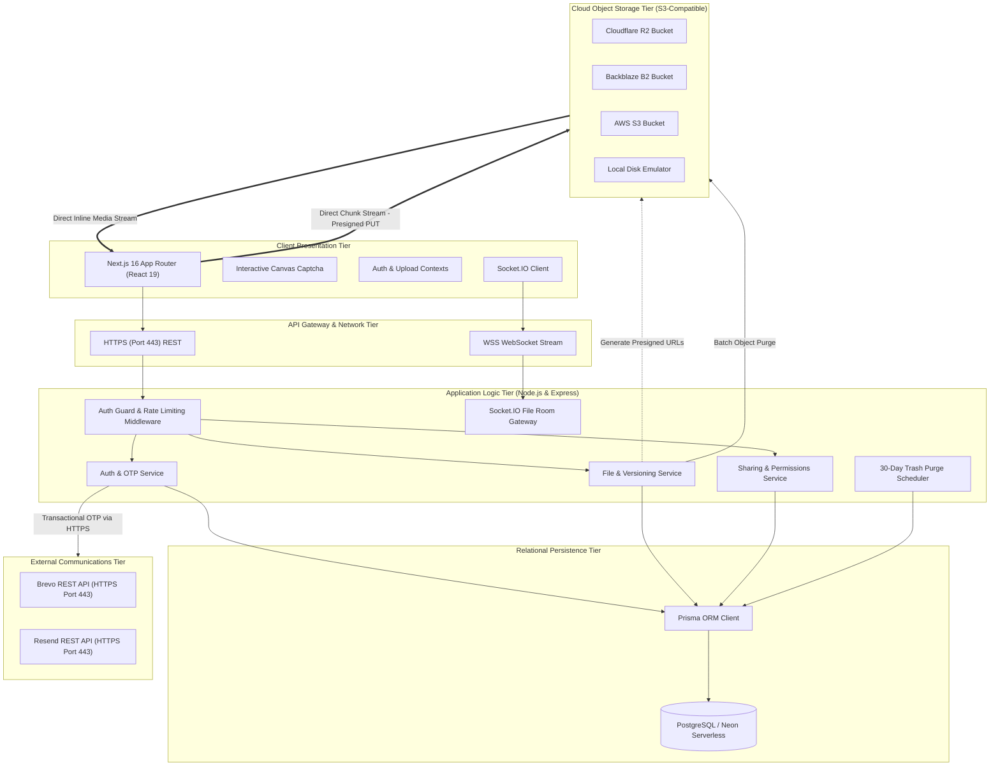
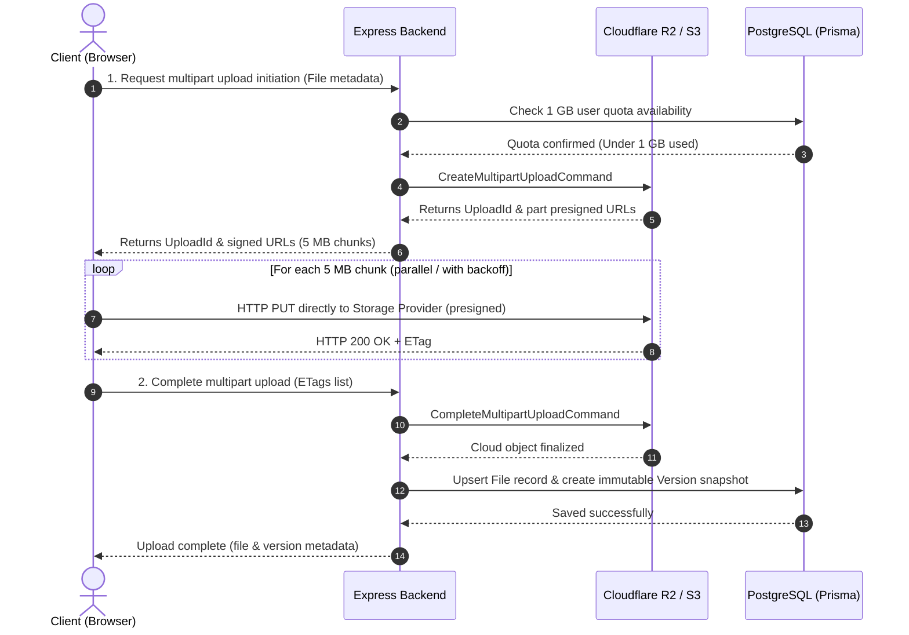
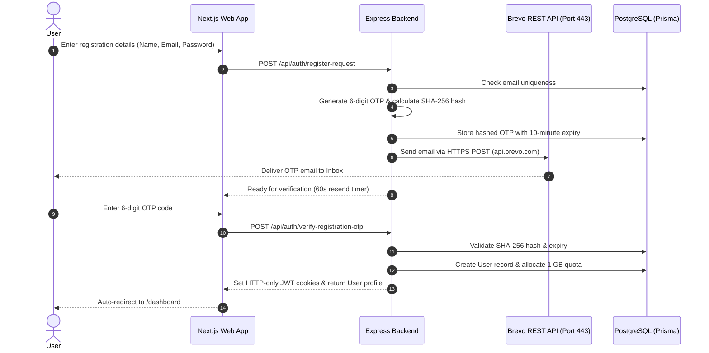
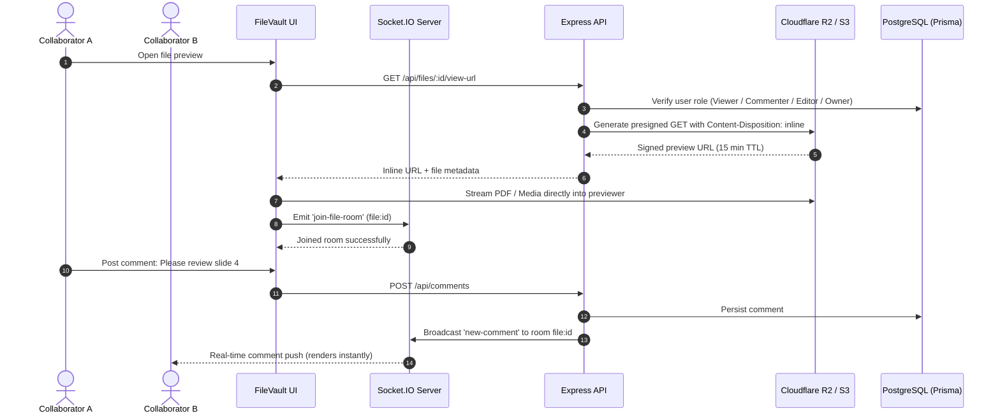
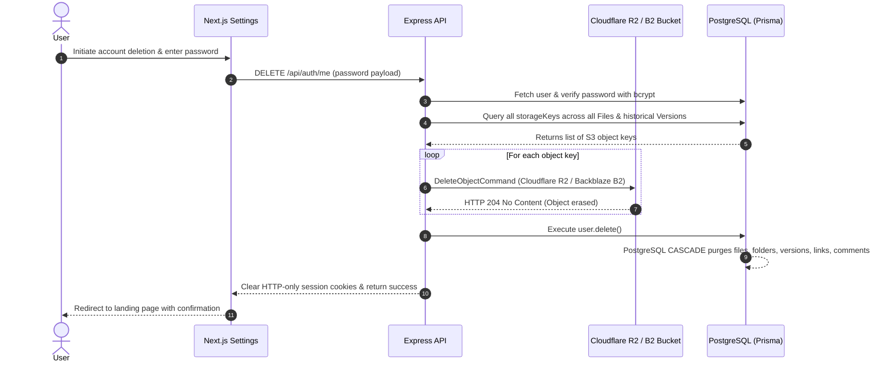

# FileVault — Enterprise Cloud Storage & Collaboration Platform

[](https://nextjs.org/)
[](https://react.dev/)
[](https://www.typescriptlang.org/)
[](https://nodejs.org/)
[](https://expressjs.com/)
[](https://neon.tech/)
[](https://www.prisma.io/)
[](https://www.backblaze.com/b2/)
[](https://www.cloudflare.com/products/r2/)
[](https://www.brevo.com/)
[](https://socket.io/)
[](https://tailwindcss.com/)

**FileVault** is a secure, modern cloud storage and real-time collaboration SaaS platform inspired by Google Drive and Dropbox. Engineered with **Next.js 16 (App Router)**, **Node.js**, **Express**, **Prisma ORM**, **PostgreSQL (Neon)**, **Cloudflare R2 / Backblaze B2 / AWS S3**, **Brevo / Resend REST APIs**, and **Socket.IO**, FileVault delivers resilient chunked resumable uploads, inline multi-format media previewing, live side-by-side commenting, granular role-based access control, password-protected public share links, anti-bot visual Captcha, verified email OTP onboarding, and comprehensive account & cloud file deletion.

---

## Key Features

### 1. Two-Step Email OTP Signup & Secure Verification
- **Verified Account Onboarding**: Eliminates unauthorized signups and typo accounts by verifying email ownership prior to account activation.
- **6-Digit Cryptographic OTP**: Emits short-lived (10-minute TTL) one-time codes stored with SHA-256 cryptographic hashing.
- **Resend Cooldown & State Machine**: Built-in 60-second cooldown protection with real-time countdown timer, input sanitization, and auto-focus monospace inputs.
- **Instant Activation**: Upon code verification, the user account is created, JWT tokens and HTTP-only session cookies are issued, and the user is redirected straight to their dashboard.

### 2. Universal HTTPS Email Delivery (Brevo & Resend)
- **Firewall & Port-Block Immune (Port 443)**: Bypasses cloud host SMTP restrictions (e.g. Render Free tier blocking outbound ports 25, 465, and 587) by routing transactional emails over standard HTTPS REST APIs.
- **Brevo REST API Integration**: Out-of-the-box support for Brevo's v3 email API (`https://api.brevo.com/v3/smtp/email`), delivering OTP emails to any recipient worldwide without requiring custom DNS domains.
- **Resend HTTPS Provider**: Direct REST provider integration with Resend (`https://api.resend.com/emails`).
- **Graceful Fallback Hierarchy**: Automatically negotiates delivery: `Brevo HTTPS` $\rightarrow$ `Resend HTTPS` $\rightarrow$ `Nodemailer SMTP (Gmail / Custom)` $\rightarrow$ `Console Provider (Local Dev)`.

### 3. Chunked Resumable Uploads & Multi-Cloud S3 Storage
- **Resumable Multipart Uploads**: Uploads large multi-gigabyte files reliably by slicing files into 5 MB chunks with parallel uploading and automatic exponential backoff retries.
- **Direct-to-Storage Presigned URLs**: Client streams chunks directly to **Cloudflare R2**, **Backblaze B2**, or **AWS S3** via presigned URLs, avoiding server memory bottlenecks.
- **Automatic Region Resolution**: Auto-adapts cluster regions for custom S3-compatible endpoints.
- **Mock Storage Emulator**: Built-in local mock storage provider emulating S3 presigned PUT/GET flows for zero-dependency local development.
- **Checksum Verification**: Validates SHA-256 hashes on upload finalization to protect against corruption.

### 4. 1 GB Storage Quota Management
- **Per-User Quota Allocation**: Every account receives a dedicated 1 GB ($1024^3$ bytes) cloud storage quota.
- **Dynamic Usage Meters**: Real-time storage consumption gauges across the sidebar, dashboard, settings, and upload progress drawer.
- **Pre-Upload Space Validation**: Blocks files that exceed remaining storage before chunks begin streaming to cloud buckets.

### 5. Permanent Account Deletion & Complete Cloud Wipe
- **Permanent Cloud Object Purge**: Queries every physical storage key owned by the user (including all historical snapshot versions) and executes batch `DeleteObjectCommand` against Cloudflare R2 / Backblaze B2.
- **Full Database Cascade Purge**: Uses PostgreSQL foreign-key `CASCADE` rules to permanently erase the user record, folders, files, versions, share links, permissions, comments, notifications, activity logs, and active JWT sessions.
- **Password Confirmation Safeguard**: Requires explicit password verification before initiating the irreversible purge.

### 6. Enterprise Authentication & Anti-Bot Safeguards
- **Interactive Alphanumeric Visual Captcha**: Canvas-rendered 6-character anti-bot challenge on `/login` featuring randomized font sizing, character tilt, distortion bezier curves, and noise dots (excluding ambiguous characters `0/O/1/l/I`).
- **OTP Password Reset**: 3-step self-service password recovery flow (`/forgot-password`) with SHA-256 hashed 6-digit codes and 10-minute expiry.
- **Session Revocation**: Automatically invalidates and refreshes authentication tokens upon successful password changes to terminate compromised sessions.

### 7. Universal Inline Media & Document Previewer
- **PDF Documents**: Direct embedded reader using `Content-Disposition: inline` and proper MIME negotiation, eliminating forced downloads.
- **Images**: Interactive lightbox with Zoom In/Out, 90° rotation, and pan controls.
- **Videos**: HTML5 streaming player with playback speed and fullscreen controls.
- **Audio**: Custom streaming audio player with waveform scrubbing and volume controls.
- **Code & Text**: Monospace viewer with line numbering and one-click copy to clipboard.

### 8. Real-Time Collaboration & Document Discussions
- **Socket.IO File Rooms**: Active collaborators join isolated real-time rooms (`file:${id}`) upon opening document previews.
- **Live Comments**: Bi-directional comment threads with instantaneous updates across all viewers.
- **Activity Feedback**: Live user activity indicators and in-app notification bell with unread badge counters.

### 9. Granular RBAC & Protected Share Links
- **Role-Based Collaboration**: Share files and folders with registered users:
  - **Viewer**: Read-only preview and download permissions.
  - **Commenter**: Preview, download, and participate in discussion threads.
  - **Editor**: Rename, move, upload new versions, and manage content.
  - **Owner**: Full authority, permanent deletion, and collaborator administration.
- **Public Share Links**: Generate secure external links with:
  - **Bcrypt Password Protection**: Enforces cryptographic password verification before granting access.
  - **Expiration Timers**: Automatically revokes access after custom durations.
  - **Download Tracking**: Real-time analytics on public link downloads and access counts.

### 10. Snapshot Version History & 30-Day Trash Bin
- **Immutable Version History**: Uploading changes creates distinct snapshot versions without overwriting previous work.
- **One-Click Version Restore**: Roll back to any historical snapshot instantly while preserving all intermediate versions.
- **Two-Stage Soft Deletion**: Deleted files move to the Trash Bin with a 30-day recovery buffer.
- **Automated Trash Cleanup**: Background cron scheduler purges expired trash items automatically to reclaim cloud storage space.
- **Selective & Bulk Purge**: Restore or permanently purge individual files, or empty the entire trash bin with confirmation modals.

### 11. Custom Dialogs & Dual-Theme Engine
- **Custom Confirmation Modal (`ConfirmModal`)**: Replaced browser `confirm()` and `alert()` popups with styled dialogs featuring action-specific variants (`danger`, `warning`, `primary`, `success`), loading spinners, and keyboard shortcuts (`Escape` / `Enter`).
- **Dark & Light Mode**: Tailored HSL color palette with smooth CSS transitions and dark mode persistence via `ThemeContext`.

---

## Tech Stack

| Layer | Technology | Description |
| :--- | :--- | :--- |
| **Frontend Framework** | [Next.js 16](https://nextjs.org/) | App Router with Turbopack & React Server Components |
| **UI Library** | [React 19](https://react.dev/) | Concurrent mode & optimized state hooks |
| **Styling** | [Tailwind CSS v4](https://tailwindcss.com/) | Modern utility-first CSS design system |
| **Icons** | [Lucide React](https://lucide.dev/) | Clean, lightweight SVG icon suite |
| **Real-Time WebSockets** | [Socket.IO Client](https://socket.io/) | Bi-directional streaming for live comments & alerts |
| **Backend Runtime** | [Node.js](https://nodejs.org/) & [Express](https://expressjs.com/) | RESTful API server with TypeScript |
| **Database** | [PostgreSQL](https://www.postgresql.org/) (Neon Serverless) | Relational database with composite indexing |
| **ORM** | [Prisma ORM 6](https://www.prisma.io/) | Type-safe schema migrations & query builder |
| **Cloud Storage** | [Cloudflare R2](https://www.cloudflare.com/products/r2/) / [Backblaze B2](https://www.backblaze.com/b2/) / [AWS S3](https://aws.amazon.com/s3/) | S3-compatible object storage with presigned multipart URLs |
| **Local Storage** | Custom `MockStorageProvider` | Local disk storage emulator for zero-dependency development |
| **Transactional Email** | [Brevo REST API](https://www.brevo.com/) & [Resend API](https://resend.com/) | HTTPS port 443 email dispatch for Signup and Password Reset OTPs |
| **SMTP Fallback** | [Nodemailer](https://nodemailer.com/) | SMTP mailer with console output fallback |
| **Security & Auth** | JWT, Bcrypt & HTML5 Canvas | HTTP-only cookie tokens, bcrypt salt hashing, anti-bot visual Captcha |
| **Background Tasks** | Node-cron | Scheduled 30-day soft-delete trash purge worker |

---

## Project Architecture

```
FileManager/
├── prisma/
│   └── schema.prisma                 # Schema: User, File, Folder, Version, Permission, ShareLink, Comment, EmailVerification
├── backend/
│   ├── src/
│   │   ├── config/                   # Database, storage providers, CORS, and environment loader
│   │   ├── controllers/              # REST controllers (auth, file, folder, version, share, comment, trash)
│   │   ├── email/                    # Brevo, Resend, Nodemailer SMTP & console email providers
│   │   ├── jobs/                     # Cron scheduler for 30-day automated trash purge
│   │   ├── middleware/               # Auth guard, rate limiters, request validation, error handler
│   │   ├── repositories/             # Prisma data access layer with composite permission queries
│   │   ├── routes/                   # Route dispatchers (/api/auth, /api/files, /api/shared, etc.)
│   │   ├── services/                 # Business logic, permissions enforcement, download URLs, OTP services
│   │   ├── socket/                   # Socket.IO room manager & real-time collaboration events
│   │   ├── storage/                  # StorageProvider contract (Backblaze B2, Cloudflare R2, AWS S3, MockStorage)
│   │   ├── utils/                    # ApiError, logger, token signers, formatters
│   │   ├── app.ts                    # Express application setup & middleware stack
│   │   └── server.ts                 # HTTP server bootstrap & WebSocket lifecycle
│   ├── package.json
│   └── tsconfig.json
├── frontend/
│   ├── app/
│   │   ├── (auth)/                   # Authentication pages: /login, /register, /forgot-password
│   │   ├── (dashboard)/              # Main dashboard: /dashboard, /trash, /starred, /recent, /search, /settings
│   │   │   ├── layout.tsx            # Dashboard layout with 1GB quota meters & sidebar navigation
│   │   │   └── page.tsx              # Primary file manager workspace view
│   │   ├── (public)/s/[token]/       # Public file view & password-protected download portal
│   │   ├── layout.tsx                # Root layout with ThemeProvider, AuthProvider, and creator Footer
│   │   ├── page.tsx                  # Public landing page: Hero, Capabilities, Features, Security, Pricing
│   │   └── globals.css               # Tailwind CSS v4 directives & custom scrollbars
│   ├── components/
│   │   ├── comments/                 # CommentThread and real-time discussion list
│   │   ├── dashboard/                # ActivityFeed, QuickActions, StorageUsageCard
│   │   ├── files/                    # FilePreviewModal, VersionHistoryModal, NewFolderModal, RenameModal
│   │   ├── landing/                  # Navbar, Hero, CapabilityBar, Features, Security, Pricing, FinalCTA
│   │   ├── notifications/            # NotificationBell popover & unread counter
│   │   ├── search/                   # GlobalSearchBar with dropdown autocomplete
│   │   ├── sharing/                  # ShareModal (collaborator RBAC & public link generator)
│   │   ├── ui/                       # Captcha (Canvas anti-bot), ConfirmModal (custom dialogs), ThemeToggle
│   │   ├── upload/                   # Chunked upload progress drawer & drag-and-drop overlay
│   │   └── Footer.tsx                # Global creator attribution footer
│   ├── context/                      # AuthContext, ThemeContext, UploadContext
│   ├── hooks/                        # useAuth, useSocket, useUpload
│   ├── lib/                          # Type-safe API client (fileApi, shareApi, commentApi, versionApi, trashApi)
│   ├── package.json
│   └── tsconfig.json
├── .gitignore                        # Global Git ignore rules
└── README.md                         # Project documentation
```

---

## System Architecture

The FileVault platform is built on a decoupled, tiered micro-modular architecture designed for scalability, zero-trust security, and high performance.



### Architectural Layers

| Layer | Components | Core Responsibilities |
| :--- | :--- | :--- |
| **Presentation Layer** | Next.js 16, React 19, Tailwind CSS v4, Lucide Icons | Client-side routing, responsive UI, drag-and-drop chunk streaming, multi-format media previewing, and anti-bot canvas verification. |
| **Communication Layer** | Express REST API & Socket.IO Gateway | Stateless HTTP endpoint handling, cookie-based session verification, sliding-window rate limiting, and real-time bi-directional room management. |
| **Application Layer** | TypeScript Services & Controllers | Business logic orchestration, permission evaluations (Owner/Editor/Commenter/Viewer), presigned URL signing, OTP state machines, and cron workers. |
| **Data Persistence Layer** | Prisma ORM & PostgreSQL (Neon) | ACID-compliant relational data management, composite indexes for high-speed permission lookups, and foreign-key cascade lifecycles. |
| **Object Storage Layer** | Cloudflare R2 / Backblaze B2 / AWS S3 / Local Mock | Distributed S3-compatible binary storage receiving direct chunked streams from client browsers without intermediate proxy overhead. |
| **Notification Layer** | Brevo & Resend REST APIs | Outbound transactional email delivery via standard HTTPS port 443, eliminating port-blocking failures common on cloud host free tiers. |

---

## System Workflows

FileVault isolates complex operations into discrete, asynchronous pipelines to maintain high responsiveness and strict data integrity.

### 1. Resumable Direct-to-Cloud Upload & Versioning Workflow



- **Zero Server Bottleneck**: Binary streams bypass backend memory entirely; files flow directly from the browser to cloud storage.
- **Quota Enforced First**: Backend validates that the incoming file size does not exceed the user's remaining 1 GB storage allowance before creating cloud upload sessions.
- **Non-Destructive Versioning**: Every subsequent upload targeting an existing file generates a new snapshot version, ensuring previous revisions are retained.

---

### 2. Two-Step Email OTP Onboarding & Recovery Workflow



- **Port-Block Immune**: By dispatching email requests over standard HTTPS port 443 via Brevo/Resend REST endpoints, emails are reliably delivered regardless of host SMTP restrictions.
- **Cryptographic Security**: Plaintext OTP codes are never stored in the database; only SHA-256 hashes are persisted and compared.

---

### 3. Real-Time Collaboration & Document Viewing Workflow



- **Direct In-Browser Viewing**: Documents and media render inline with dynamic MIME negotiation (`application/pdf`, `image/*`, `video/*`), eliminating unwanted forced downloads.
- **Isolated Collaboration Channels**: Each file maintains its own isolated Socket.IO room so events are strictly scoped to active viewers.

---

### 4. Account Deletion & Complete Cloud Wipe Workflow



- **Zero Orphaned Data**: Both cloud object binaries and database rows are purged completely, ensuring full compliance and complete user data removal.
- **Cryptographic Gate**: Account deletion is protected by explicit password verification before destructive actions begin.

---

## Security Architecture

1. **Defense-in-Depth Authentication**: Access and refresh tokens are issued via HTTP-only, secure, `SameSite` cookies, completely mitigating client-side XSS token theft.
2. **Short-Lived Signed URLs**: All storage operations (uploads, previews, and downloads) utilize time-limited signed URLs (default 15 to 60 minutes). Raw cloud credentials never touch the browser.
3. **Cryptographic Integrity**: Uploads support SHA-256 checksum hashing to verify that file contents on disk match client bytes precisely.
4. **Collision-Resistant CUIDs**: All database entities use collision-resistant `cuid()` identifiers instead of auto-incrementing integers, preventing enumeration attacks.
5. **Two-Tier Deletion Protection**: Soft-deleted files are safely stored in a 30-day trash buffer before being eligible for permanent garbage collection.
6. **Sliding-Window Rate Limiting**: Protects sensitive endpoints (authentication, file downloads, public password verification) against automated brute-force attacks.
7. **Interactive Visual Anti-Bot Captcha**: Canvas-rendered alphanumeric challenge defends authentication endpoints against automated bot attacks and credential stuffing without tracking user privacy.
8. **SHA-256 Hashed OTP System**: 6-digit one-time codes for registration and password recovery are hashed using SHA-256 in the database, enforced with a strict 10-minute TTL, and immediately invalidate all prior active user sessions upon password reset.
9. **Full Data Wipe Capability**: Ensures complete user privacy and compliance by permanently destroying all physical cloud storage files upon account deletion.

---

## Author

Developed with ❤️ by **Tanish**
- **GitHub**: [@Tanishpal23](https://github.com/Tanishpal23)
- **Repository**: [FileVault](https://github.com/Tanishpal23/FileVault)
