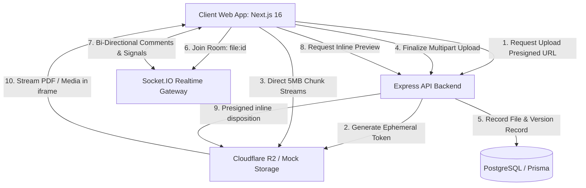

# FileVault — Enterprise Cloud Storage & Collaboration Platform

[](https://nextjs.org/)
[](https://react.dev/)
[](https://www.typescriptlang.org/)
[](https://nodejs.org/)
[](https://expressjs.com/)
[](https://neon.tech/)
[](https://www.prisma.io/)
[](https://www.backblaze.com/b2/)
[](https://www.cloudflare.com/products/r2/)
[](https://socket.io/)
[](https://tailwindcss.com/)

**FileVault** is an enterprise-grade, high-performance cloud storage and real-time collaboration SaaS platform inspired by Google Drive and Dropbox. Engineered with **Next.js 16 (App Router)**, **Node.js**, **Express**, **Prisma ORM**, **PostgreSQL**, **Backblaze B2 / Cloudflare R2 / AWS S3**, and **Socket.IO**, FileVault delivers resilient chunked resumable uploads, inline multi-format media previewing, live side-by-side commenting, granular role-based access control, password-protected public share links, interactive visual anti-bot Captcha, OTP password reset via SMTP, and automated snapshot version recovery.

---

## Key Features

### 1. Chunked Resumable Uploads & Multi-Cloud S3 Storage
- **Resumable Multipart Uploads**: Handles large multi-gigabyte file transfers reliably by partitioning files into 5 MB chunks with parallel uploading and automatic exponential retries.
- **Direct-to-Storage Presigned URLs**: Files upload directly to **Backblaze B2**, **Cloudflare R2**, or **AWS S3** via short-lived signed URLs, bypassing server memory and CPU bottlenecks.
- **Auto-Region S3 Resolution**: Automatically detects and adapts cluster regions from custom S3 endpoints (e.g. Backblaze B2 regional hosts).
- **Local Mock Storage Fallback**: Development-friendly local mock storage provider that emulates S3 presigned PUT/GET flows out of the box without requiring cloud credentials.
- **Checksum Verification**: Validates SHA-256 file hashes on completion to prevent bit-rot and ensure complete data integrity.

### 2. Enterprise Authentication & Security Safeguards
- **Interactive Alphanumeric Visual Captcha**: Canvas-rendered 6-character anti-bot challenge on `/login` featuring randomized font sizing, character tilt, distortion bezier curves, and noise dots (curated charset excluding ambiguous characters `0/O/1/l/I`).
- **OTP Password Reset via SMTP**: 3-step self-service password recovery flow (`/forgot-password`). Issues cryptographically secure 6-digit one-time codes with SHA-256 hashing and 10-minute expiry via Nodemailer (Gmail / custom SMTP) or console fallback.
- **Session Invalidation**: Automatically revokes and refreshes authentication tokens upon successful password changes to terminate any compromised active sessions.

### 3. Universal Multi-Format Inline Previewer
- **PDF Documents**: Direct embedded reader using `Content-Disposition: inline` and proper MIME negotiation, eliminating unwanted forced downloads.
- **Images**: Interactive lightbox with Zoom In/Out, 90° rotation, and pan controls.
- **Videos**: Built-in HTML5 streaming player with playback speed and fullscreen controls.
- **Audio**: Custom streaming audio player with track progress scrubbing and volume controls.
- **Code & Plain Text**: Monospace viewer with line numbering and one-click copy to clipboard.

### 4. Real-Time Collaboration & Document Discussions
- **Socket.IO File Rooms**: Users automatically join real-time rooms (`file:${id}`) upon opening any document preview.
- **Live Comments**: Create, edit, and delete comments with instantaneous bi-directional broadcast to all active collaborators.
- **Typing & Activity Signals**: Real-time visual feedback when team members interact with shared files.
- **Real-Time Notification Bell**: Animated in-app notification bell with unread badge counters and live push alerts.

### 5. Granular RBAC & Protected Share Links
- **Role-Based Sharing**: Share files and folders with registered users under specific roles:
  - **Viewer**: Read-only preview and download rights.
  - **Commenter**: Preview, download, and participate in comment threads.
  - **Editor**: Rename, move, upload new versions, and manage content.
  - **Owner**: Full authority, permanent deletion, and collaborator administration.
- **Public Share Links**: Generate secure external links with:
  - **Bcrypt Password Protection**: Enforces cryptographic password verification before granting access.
  - **Expiration Timers**: Automatically revokes access after custom durations.
  - **Download Tracking**: Real-time count of public link access and file downloads.

### 6. Snapshot Version History & 30-Day Trash Bin
- **Immutable Version History**: Every version upload creates a distinct snapshot version without overwriting past iterations.
- **One-Click Version Restore**: Roll back to any historical snapshot instantly while preserving all intermediate versions.
- **Two-Stage Soft Deletion**: Deleted files move to the Trash Bin with a 30-day recovery buffer.
- **Scheduled Auto-Purge**: Background cron scheduler cleans up expired trash items automatically to reclaim cloud storage space.
- **Bulk Empty & Selective Permanent Delete**: Permanently purge individual items or empty the entire trash bin with confirmation safeguards.

### 7. Search, Filter & Discovery Hub
- **Universal Autocomplete Search**: Search files and folders simultaneously by filename, extension, or folder hierarchy.
- **Multi-Dimension Filters**: Filter by file type (`Documents`, `Images`, `Videos`, `Audio`, `Spreadsheets`, `Archives`), date ranges (`Today`, `Last 7 Days`, `Last 30 Days`), and star status.
- **Starred & Recent Shortcuts**: Quick-access views for priority items and recently modified documents.

### 8. Custom Dialogs & Dual-Theme Engine
- **Custom Confirmation Modal (`ConfirmModal`)**: Replaced all native browser `confirm()` and `alert()` popups with styled dialogs featuring action-specific variants (`danger`, `warning`, `primary`, `success`), loading spinners, and keyboard shortcuts (`Escape` / `Enter`).
- **Dark & Light Mode**: Tailored HSL color palette with smooth CSS transitions and dark mode persistence via `ThemeContext`.

---

## Tech Stack

| Layer | Technology | Description |
| :--- | :--- | :--- |
| **Frontend Framework** | [Next.js 16](https://nextjs.org/) | App Router with Turbopack & React Server Components |
| **UI Library** | [React 19](https://react.dev/) | Concurrent mode & optimized state hooks |
| **Styling** | [Tailwind CSS v4](https://tailwindcss.com/) | Modern utility-first CSS design system |
| **Icons** | [Lucide React](https://lucide.dev/) | Clean, lightweight SVG icon suite |
| **Real-Time WebSockets** | [Socket.IO Client](https://socket.io/) | Bi-directional streaming for live comments & alerts |
| **Backend Runtime** | [Node.js](https://nodejs.org/) & [Express](https://expressjs.com/) | RESTful API server with TypeScript |
| **Database** | [PostgreSQL](https://www.postgresql.org/) (Neon Serverless) | Relational database with composite indexing |
| **ORM** | [Prisma ORM 6](https://www.prisma.io/) | Type-safe schema migrations & query builder |
| **Cloud Storage** | [Backblaze B2](https://www.backblaze.com/b2/) / [Cloudflare R2](https://www.cloudflare.com/products/r2/) / [AWS S3](https://aws.amazon.com/s3/) | S3-compatible object storage with presigned multipart URLs |
| **Local Storage** | Custom `MockStorageProvider` | Local disk storage emulator for zero-dependency development |
| **Email Service** | [Nodemailer](https://nodemailer.com/) | SMTP mailer for 6-digit OTP password resets (with console fallback) |
| **Security & Auth** | JWT, Bcrypt & HTML5 Canvas | HTTP-only cookie tokens, bcrypt salt hashing, anti-bot visual Captcha |
| **Background Tasks** | Node-cron | Scheduled 30-day soft-delete trash purge worker |

---

## Project Architecture

```
FileManager/
├── prisma/
│   └── schema.prisma                 # Database schema: User, File, Folder, Version, Permission, ShareLink, Comment, PasswordResetToken
├── backend/
│   ├── src/
│   │   ├── config/                   # Database, storage providers, CORS, and environment loader
│   │   ├── controllers/              # REST controllers (auth, file, folder, version, share, comment, trash)
│   │   ├── email/                    # Email service interface, Nodemailer SMTP provider & console fallback
│   │   ├── jobs/                     # Cron scheduler for 30-day automated trash purge
│   │   ├── middleware/               # Auth guard, rate limiters, request validation, error handler
│   │   ├── repositories/             # Prisma data access layer with composite permission queries
│   │   ├── routes/                   # Route dispatchers (/api/auth, /api/files, /api/shared, etc.)
│   │   ├── services/                 # Business logic, permissions enforcement, download URLs, OTP password resets
│   │   ├── socket/                   # Socket.IO room manager & real-time collaboration events
│   │   ├── storage/                  # StorageProvider contract (Backblaze B2, Cloudflare R2, AWS S3, MockStorage)
│   │   ├── utils/                    # ApiError, logger, token signers, formatters
│   │   ├── app.ts                    # Express application setup & middleware stack
│   │   └── server.ts                 # HTTP server bootstrap & WebSocket lifecycle
│   ├── package.json
│   └── tsconfig.json
├── frontend/
│   ├── app/
│   │   ├── (auth)/                   # Authentication pages: /login, /register, /forgot-password
│   │   ├── (dashboard)/              # Main dashboard: /dashboard, /trash, /starred, /recent, /search
│   │   │   ├── layout.tsx            # Dashboard layout with sidebar navigation & top search header
│   │   │   └── page.tsx              # Primary file manager workspace view
│   │   ├── (public)/s/[token]/       # Public file view & password-protected download portal
│   │   ├── layout.tsx                # Root layout with ThemeProvider, AuthProvider, and creator Footer
│   │   ├── page.tsx                  # Public landing page: Hero, Capabilities, Features, Security, Pricing
│   │   └── globals.css               # Tailwind CSS v4 directives & custom scrollbars
│   ├── components/
│   │   ├── comments/                 # CommentThread and real-time discussion list
│   │   ├── dashboard/                # ActivityFeed, QuickActions, StorageUsageCard
│   │   ├── files/                    # FilePreviewModal, VersionHistoryModal, NewFolderModal, RenameModal
│   │   ├── landing/                  # Navbar, Hero, CapabilityBar, Features, Security, Pricing, FinalCTA
│   │   ├── notifications/            # NotificationBell popover & unread counter
│   │   ├── search/                   # GlobalSearchBar with dropdown autocomplete
│   │   ├── sharing/                  # ShareModal (collaborator RBAC & public link generator)
│   │   ├── ui/                       # Captcha (Canvas anti-bot), ConfirmModal (custom dialogs), ThemeToggle
│   │   ├── upload/                   # Chunked upload progress drawer & drag-and-drop overlay
│   │   └── Footer.tsx                # Global creator attribution footer
│   ├── context/                      # AuthContext, ThemeContext, UploadContext
│   ├── hooks/                        # useAuth, useSocket, useUpload
│   ├── lib/                          # Type-safe API client (fileApi, shareApi, commentApi, versionApi, trashApi)
│   ├── package.json
│   └── tsconfig.json
├── .gitignore                        # Global Git ignore rules
└── README.md                         # Project documentation
```

---

## Getting Started

### 1. Prerequisites
Ensure you have the following installed:
- [Node.js](https://nodejs.org/) version 18.x or higher
- `npm`, `pnpm`, or `yarn`
- A [PostgreSQL Database](https://neon.tech/) instance (Neon serverless or local Postgres)
- *(Optional)* A [Backblaze B2](https://www.backblaze.com/b2/), [Cloudflare R2](https://www.cloudflare.com/products/r2/), or [AWS S3](https://aws.amazon.com/s3/) account (defaults to local mock storage if omitted)
- *(Optional)* An SMTP email account (e.g. Gmail App Password) for sending OTP password reset emails (defaults to console logging if omitted)

### 2. Clone Repository
```bash
git clone https://github.com/Tanishpal23/FileManager.git
cd FileManager
```

### 3. Install Dependencies
Install dependencies for both backend and frontend:

```bash
# Install root & backend dependencies
npm install
cd backend && npm install

# Install frontend dependencies
cd ../frontend && npm install
cd ..
```

### 4. Configure Environment Variables
Create a `.env` file in the root directory:

```env
# Server Configuration
PORT=5000
NODE_ENV=development
API_URL=http://localhost:5000
FRONTEND_URL=http://localhost:3000

# PostgreSQL Database (Neon Serverless or Local)
DATABASE_URL="postgresql://<user>:<password>@<host>/<dbname>?sslmode=require"

# JWT Token Secrets (Minimum 32 characters)
JWT_ACCESS_SECRET="your-super-secure-access-token-secret-32-chars-min"
JWT_REFRESH_SECRET="your-super-secure-refresh-token-secret-32-chars-min"

# Cloud Storage: Backblaze B2 / Cloudflare R2 / AWS S3
# (Leave empty to use built-in local mock storage)
R2_ACCESS_KEY_ID="your-key-id"
R2_SECRET_ACCESS_KEY="your-application-key"
R2_BUCKET_NAME="your-bucket-name"
R2_ENDPOINT="https://s3.<region>.backblazeb2.com" # Or Cloudflare: https://<account_id>.r2.cloudflarestorage.com
# R2_ACCOUNT_ID="your-account-id" # Optional for Cloudflare R2

# Email / SMTP Configuration (for OTP Password Reset)
# (Leave empty to print OTPs directly to backend console)
SMTP_HOST="smtp.gmail.com"
SMTP_PORT=587
SMTP_SECURE=false
SMTP_USER="your-email@gmail.com"
SMTP_PASS="your-gmail-16-char-app-password"
SMTP_FROM="FileVault Security <your-email@gmail.com>"
```

Create a `.env.local` file inside the `frontend/` directory:

```env
NEXT_PUBLIC_API_URL=http://localhost:5000
NEXT_PUBLIC_SOCKET_URL=http://localhost:5000
```

### 5. Push Database Schema
Generate the Prisma client and push schema tables to PostgreSQL:

```bash
cd backend
npm run prisma:generate
npm run prisma:push
```

### 6. Run the Development Servers
Open two separate terminal windows:

```bash
# Terminal 1: Backend Server (runs on http://localhost:5000)
cd backend
npm run dev

# Terminal 2: Frontend Client (runs on http://localhost:3000)
cd frontend
npm run dev
```

Visit **`http://localhost:3000`** in your browser to start using FileVault.

---

## Available Scripts

### Root & Backend (`backend/`)
| Command | Purpose |
| :--- | :--- |
| `npm run dev` | Starts the Express API server with hot-reload via TypeScript |
| `npm run build` | Compiles backend TypeScript code into production `dist/` |
| `npm start` | Launches compiled production server (`node dist/server.js`) |
| `npm run prisma:generate` | Generates the latest Prisma client bindings |
| `npm run prisma:push` | Pushes the schema directly to PostgreSQL without migration lock |
| `npm run prisma:migrate` | Runs formal production database migrations |

### Frontend (`frontend/`)
| Command | Purpose |
| :--- | :--- |
| `npm run dev` | Starts the Next.js 16 development server with Turbopack |
| `npm run build` | Compiles optimized Next.js production client bundle |
| `npm run start` | Serves the Next.js production build |
| `npm run lint` | Runs Next.js ESLint quality checks |

---

## System Workflow & Architecture



1. **Direct Upload Flow**: The client requests presigned upload parts from the backend. Chunks stream directly to storage, keeping server CPU and memory free.
2. **Instant Versioning**: Completing an upload automatically creates a version record in PostgreSQL. Subsequent uploads to the same file increment version numbers without data loss.
3. **Live Collaboration**: Opening any file connects the client to a dedicated Socket.IO room, enabling side-by-side discussions, mentions, and collaborator signals.
4. **Inline Document Preview**: Files are served with dynamic MIME mapping (`application/pdf`, `image/*`, `video/*`) and `Content-Disposition: inline`, allowing seamless in-browser previewing.

---

## Security Architecture

1. **Defense-in-Depth Authentication**: Access and refresh tokens are issued via HTTP-only, secure, `SameSite=Strict` cookies, completely mitigating client-side XSS token theft.
2. **Short-Lived Signed URLs**: All storage operations (uploads, previews, and downloads) utilize time-limited signed URLs (default 15 to 60 minutes). Raw cloud credentials never touch the browser.
3. **Cryptographic Integrity**: Uploads support SHA-256 checksum hashing to verify that file contents on disk match client bytes precisely.
4. **Collision-Resistant CUIDs**: All database entities use collision-resistant `cuid()` identifiers instead of auto-incrementing integers, preventing enumeration attacks.
5. **Two-Tier Deletion Protection**: Soft-deleted files are safely stored in a 30-day trash buffer before being eligible for permanent garbage collection.
6. **Sliding-Window Rate Limiting**: Protects sensitive endpoints (authentication, file downloads, public password verification) against automated brute-force attacks.
7. **Interactive Visual Anti-Bot Captcha**: Canvas-rendered alphanumeric challenge defends authentication endpoints against automated bot attacks and credential stuffing without tracking user privacy.
8. **SHA-256 Hashed OTP Recovery**: 6-digit one-time password reset codes are hashed using SHA-256 in the database, enforced with a strict 10-minute TTL, and immediately invalidate all prior active user sessions upon completion.

---

## Author

Developed with ❤️ by **Tanish**
- **GitHub**: [@Tanishpal23](https://github.com/Tanishpal23)
- **Repository**: [FileVault](https://github.com/Tanishpal23/FileVault)
